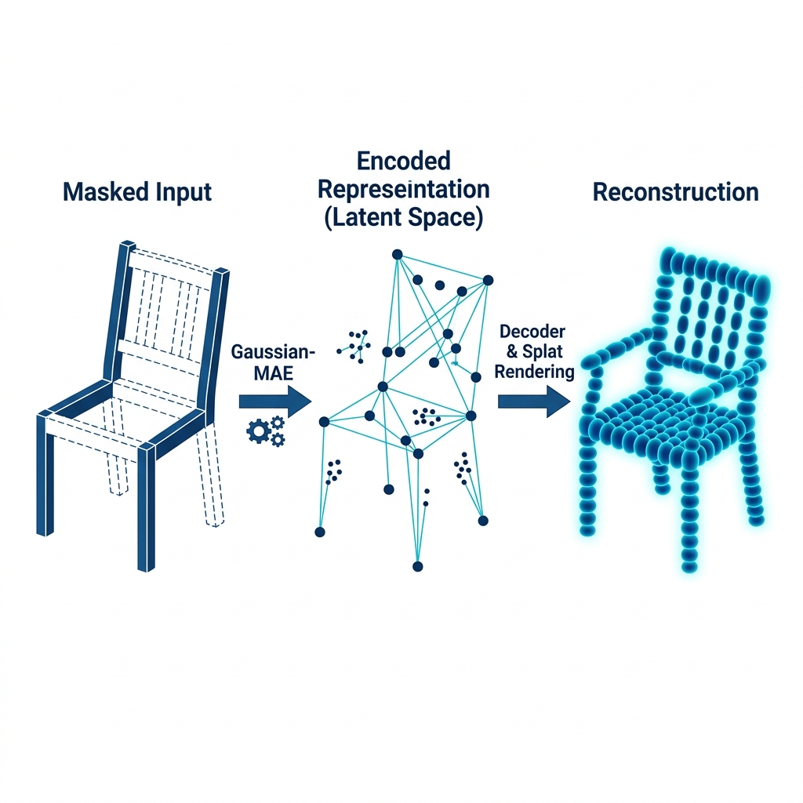

# ShapeSplat-Gaussian_MAE: 3B Geometrik Temsil Öğrenme ve Gelişmiş Rekonstrüksiyon

<p align="center">
    
</p>

---

## 🌟 Proje Özeti

Bu depo, **3B Gaussian Splatting (3DGS)** ve **Masked Autoencoders (MAE)** tekniklerini birleştirerek 3 boyutlu nesne temsillerini öğrenmek ve bu temsilleri **sınıflandırma (classification)** ve **segmentasyon (segmentation)** gibi alt görevlerde (downstream tasks) kullanmak amacıyla geliştirilmiş gelişmiş bir araştırma ekosistemidir.

Bu çalışma, orijinal [ShapeSplat-Gaussian_MAE](https://github.com/qimaqi/ShapeSplat-Gaussian_MAE) temel alınarak geliştirilmiş; **İstanbul Teknik Üniversitesi (İTÜ)** bünyesinde yapılan araştırmalarla özelleştirilmiş ve genişletilmiştir.

### 🚀 Temel Yenilikler ve Başarılar

*   **Gelişmiş Ön Eğitim (Pre-training):** 300 epoch'luk tam eğitim döngüsü ile loss değeri **2953'ten 727'ye** düşürülerek yüksek kaliteli rekonstrüksiyon yeteneği kanıtlanmıştır.
*   **Kısmi Veri Seti Stratejisi (Partial Dataset Strategy):** Donanım kısıtlarını aşmak amacıyla geliştirilen dinamik veri yükleme mekanizması ile 35.000+ nesne üzerinde verimli eğitim imkanı sağlanmıştır.
*   **Teknik İnovasyonlar:**
    *   **Scale-Aware Grouping:** Nesne geometrisindeki ince detayları korumak için ölçek bazlı gruplama.
    *   **Attention-Based Pooling:** Özellik çıkarımında anlamsal önem derecesini belirleyen dikkat mekanizmalı pooling.
*   **Domain-Specific Normalization:** Gaussian parametreleri için özel dönüşüm (Sigmoid/Exp) ve normalizasyon şemaları çözülmüştür.
*   **Eksiksiz Pipeline:** Veri hazırlamadan eğitime, finetune'dan demo uygulamalarına kadar uçtan uca bir yapı kurulmuştur.

---

## 🚀 Model Checkpoints (Ağırlıklar)

Model dosyaları 500 MB sınırına yakın (veya LFS gerektiren boyutlarda) olduğu için Google Drive üzerinde barındırılmaktadır. Aşağıdaki tablodan indirebilirsiniz:

| Model Adı | Boyut | Drive Linki |
|-----------|-------|-------------|
| ShapeSplat General Base | 334 MB | [İndir (LINK_GELECEK)](#) |
| ShapeSplat LLFF Final | 334 MB | [İndir (LINK_GELECEK)](#) |
| ShapeSplat Partial Specialist | 334 MB | [İndir (LINK_GELECEK)](#) |
| ModelNet40 Best (Demo) | 254 MB | [İndir (LINK_GELECEK)](#) |

İndirdiğiniz `.pth` dosyalarını `BEST_MODELS/` dizini altına yerleştiriniz.

---

## 🏗️ Teknik Mimari

Modelimiz, Gauss primitives (xyz, opacity, scale, rotation, sh) üzerinden özellik öğrenen bir **Transformer Encoder-Decoder** yapısını temel alır.

| Bileşen | Detay |
| :--- | :--- |
| **Giriş (Input)** | Sparse 3D Gaussian Splats |
| **Masking** | Rastgele maskeleme (Ratio: 0.6) |
| **Encoder** | 12 Katmanlı Transformer, 384 Boyut |
| **Decoder** | 4 Katmanlı Transformer |
| **Supervisor** | Chamfer Distance & Gaussian Attribute Loss |

---

## 📈 Araştırma Sonuçları

Yapılan testlerde, ön eğitimli modelin nesne geometrisini "hayal etme" (hallucinate) ve anlamsal olarak anlama yeteneği doğrulanmıştır.

### Rekonstrüksiyon Performansı
Model, eksik bırakılan nesne parçalarını orijinal yapıya uygun şekilde tamamlayabilmektedir.

### Sınıflandırma (ModelNet40)
Finetune işlemleri sonunda **ModelNet40** test setinde yüksek doğruluk oranlarına ulaşılmıştır. 
*(Detaylı PSNR/SSIM tabloları için `./archive/docs/report.pdf` dosyasına bakınız.)*

---

## 🛠️ Kurulum ve Kullanım

### Gereksinimler
- **OS:** Linux
- **GPU:** NVIDIA (CUDA 11.8+)
- **Python:** 3.9+

### Adım 1: Ortamı Kurun
```bash
conda env create -f env_fixed.yaml
conda activate shape_splat
```

### Adım 2: Bağımlılıkları Derleyin
```bash
cd pointnet2_pytorch && python setup.py install
```

### Adım 3: Eğitim ve Demo
**Rekonstrüksiyon Demosu:**
```bash
python demo_use_case/run_demo.py --ckpts BEST_MODELS/ShapeSplat_General_Base.pth
```

**Sınıflandırma Analizi:**
```bash
python experiments/demo_classification/run.sh
```

---

## 📂 Dosya Yapısı

*   `BEST_MODELS/`: En iyi performans veren model ağırlıkları.
*   `cfgs/`: Eğitim ve veri seti konfigürasyonları.
*   `demo_use_case/`: Görselleştirme ve rekonstrüksiyon araçları.
*   `monitoring/`: Eğitim sürecini takip eden scriptler.
*   `archive/docs/`: Akademik raporlar ve teknik dokümanlar.

---

## ✒️ Referans ve Teşekkür

Bu proje, **ShapeSplat** yazarlarının resmi kod tabanı üzerine inşa edilmiştir.

> **Orijinal Çalışma:** Qi Ma, Yue Li, Bin Ren, et al. "A Large-Scale Dataset of Gaussian Splats and Their Self-Supervised Pretraining", 2025.

**Geliştiren:** [Metin Ertekin Küçük](https://github.com/metinertekin)  
**Kurum:** İstanbul Teknik Üniversitesi, Bilgisayar Mühendisliği Bölümü

---

## 📜 Lisans
Bu proje orijinal ShapeSplat lisans kurallarına tabidir. Ticari kullanımdan önce lütfen orijinal yazarlarla iletişime geçiniz.
